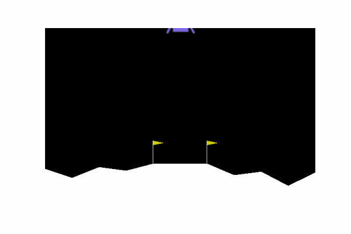

# HEC_80629A_H2021
Learning Project,

# How to use (DQN family)

in the command line
```cmd
python run.py --conf configurations/lunarlander_dqn.json
```

in Colab, download the code
```python
!rm -rf HEC_80629A_H2021/
!git clone https://github.com/qzhou-2020/HEC_80629A_H2021.git
```

link you google drive

```python
from google.colab import drive
drive.mount('/content/drive')
```

install the package

```python
!apt install python-opengl
!apt install ffmpeg
!apt install xvfb
!apt install imagemagick

!pip install box2d
!pip install gym[box2d]
!pip install pyvirtualdisplay
```

add code path to the sys.path

```python
import sys
sys.path.insert(0, "HEC_80629A_H2021")
```
run the code

```python
%run HEC_80629A_H2021/run.py --conf HEC_80629A_H2021/configurations/lunarlander_ddqn_per.json
```

make gif or mp4
```python
%run HEC_80629A_H2021/eval_policy.py saved_policy_dir env_name --save --save-to filename.gif
```

# How to use (DDPG and PPO)

Upload Jupyter Notebooks (ddpg.ipynb, PPO_pytorch_continous.ipynb under "policy_based models" folder) to Colab and execute.

# Demo


